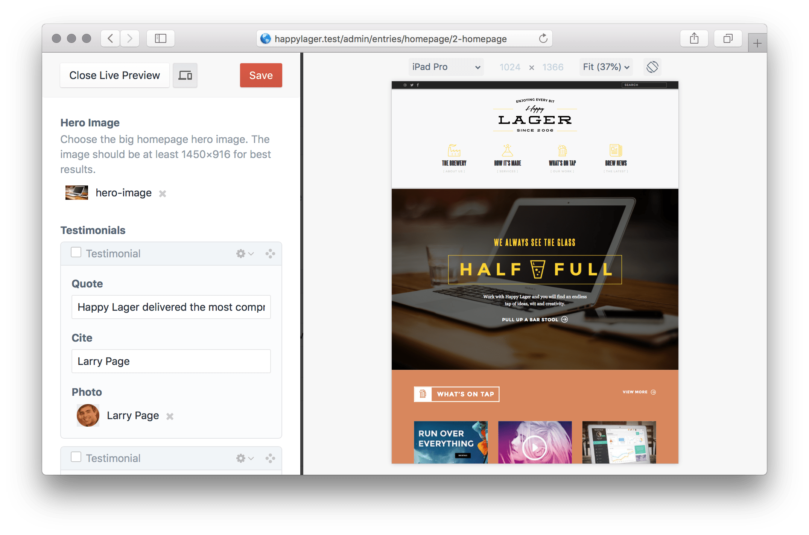

# Breakpoint for Craft CMS 3

> Preview and test your layouts on different screen sizes in Crafts Live Preview.

## Features

*   Customize your own screen presets or choose from a list of popular devices.
*   Can be enabled or disabled at any time with the click of a button.
*   Automatic zoom keeps the whole preview visible even at large screen sizes.
*   Simple, client-friendly settings page. [Screenshot](resources/settings.png)

## Installation

Install this plugin from the Plugin Store or with Composer.

### Plugin Store

Go to the Plugin Store in your projects Control Panel and search for „Breakpoint“. Then click on the „Install“ button in its modal window.

### Composer

Open your terminal and run the following command inside your project directory:

    $ composer require michaelhue/craft-breakpoint

Open the Control Panel and navigate to **Settings → Plugins** and install the plugin or use the terminal:

    $ php craft install/plugin breakpoint

## Licensing

The license fee for this plugin is **$29 one-time** via the Craft Plugin Store, including all future updates.

## Usage

### Live Preview

The plugin automatically extends Crafts Live Preview when enabled.

1.  Go to the **Entries** page in the Control Panel and click on an entry to open the edit page.
2.  Open Live Preview and click on the device button () in the top left area of the window.
3.  Use the device toolbar to test your entry layout.
4.  When your are done testing click the device button again to restore the default Live Preview.

### Customization

The plugin settings are available at **Settings → Breakpoint**.

If you prefer using a configuration file, copy the [`config.php`](src/config.php) file to `config/breakpoint.php` inside your project and edit the contents.

## Caveats

*   While the plugin functionality is similar to most browsers device preview, it does not emulate touch-events or user-agents.
*   May not work with other plugins that extend or change the Live Preview.

## Support

*   [Issues](https://github.com/michaelhue/craft-breakpoint/issues)
*   [Changelog](CHANGELOG.md)
