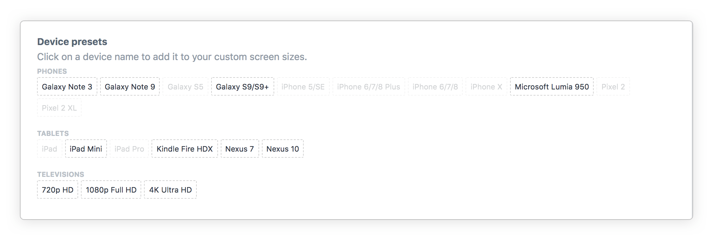

# Breakpoint User Manual

**Breakpoint** is a Plugin for [Craft CMS 3](https://craftcms.com/) that extends its [Live Preview](https://craftcms.com/features/live-preview) feature with a **Viewport Editor**. Use the Editor to test your Entries on different viewport dimensions like mobile phones and tablets.

## Table of contents

-   [Using the Viewport Editor](#using-the-viewport-editor)
    -   [Responsive Viewport Mode](#responsive-viewport-mode)
    -   [Preset Mode](#preset-mode)
    -   [Zoom the viewport](#zoom-the-viewport)
    -   [Viewport orientation](#viewport-orientation)
-   [Customizing Viewport Presets](#customizing-viewport-presets)
-   [Resources](#resources)

## Using the Viewport Editor

The **Viewport Editor** is available in Craft’s Live Preview. Click the **Toggle Viewport Editor**  to open the user interface that enables manipulation of the Live Preview viewport.

_**Figure 1.** The Toggle Viewport Editor button._

The preview window on the right changes to show the simulated viewport and the Editor Toolbar at the top. By default the Viewport Editor opens in Responsive Viewport Mode as shown in **Figure 2**.

_**Figure 2.** The Viewport Editor interface._

### Responsive Viewport Mode

Drag the handles to resize the viewport to whatever dimensions you need. Or, use the width and height boxes at the top to enter specific values. In **Figure 3** the width is set to `520` and the height is set to `480`.

_**Figure 3.** The input boxes and draggable handles for changing viewport size in Responsive Viewport Mode._

#### Tips

-   While editing the width or height you can press the up `↑` and down `↓` arrow keys to increase or decrease the value by `1`. Hold the shift key to change the value by `10`.
-   Double-click on any of the three handles to reset the corresponding dimension(s) to `100%`.

### Preset Mode

To simulate the dimensions of a specific mobile device, select the preset from the **Presets** list.

_**Figure 4.** The Presets list._

#### Tips

-   The list of presets if fully customizable on the Plugin’s Settings page, see [Customizing Viewport Presets](#customizing-viewport-presets).
-   When the **Presets** list is in focus press the left `←` or right `→` arrow key to step through the options.

### Zoom the viewport

Use the **Zoom** list to lock the viewport to a specific scale.

The default mode **Fit** will scale the viewport down automatically if there is not enough space to show it at 100%.

_**Figure 5.** Zoom options._

### Viewport orientation

Click the **Rotate**  button to toggle between portrait and landscape orientation.

## Customizing Viewport Presets

Navigate to the plugin settings page at **Settings → Breakpoint**. Use the **Viewport presets** table to add, change and delete items.

_**Figure 6.** The Viewport presets table._

Below the table you will find **Device presets**, a list of popular devices and their viewport dimensions. Click on any item you want to add to your list of custom presets.

_**Figure 7.** The Device presets list._

### Tips

-   You can add dividers by setting the title to `---` (three dashes).
-   It’s possible to set width or height to `0`, which means `100%`.
-   If you prefer using a configuration file, copy [`config.php`](`../src/config.php) to `config/breakpoint.php` and edit the file contents.

## Resources

-   [Homepage](https://github.com/michaelhue/craft-breakpoint) – Return to the home page.
-   [Changelog](https://github.com/michaelhue/craft-breakpoint/blob/master/CHANGELOG.md) – View recent changes and bug fixes.
-   [Issues](https://github.com/michaelhue/craft-breakpoint/issues) – Submit bug reports, feature requests and general questions.
